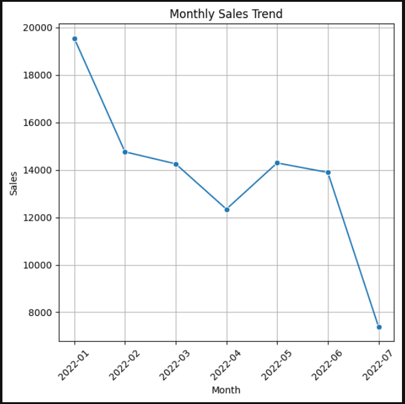
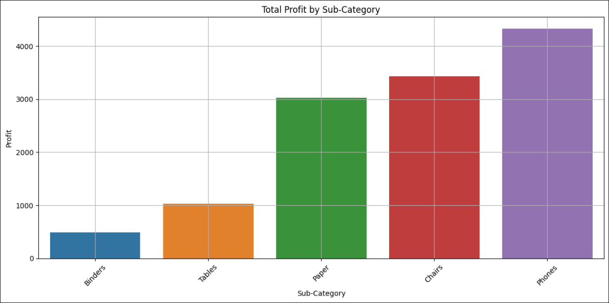
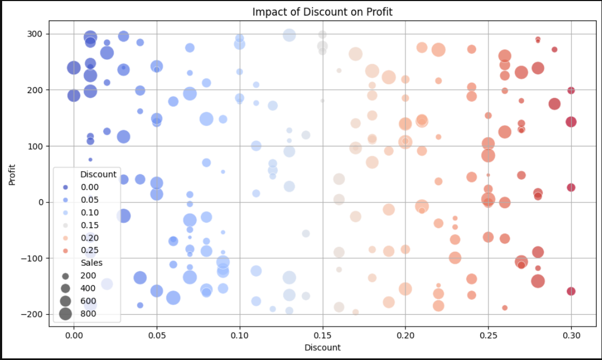

# Superstore Data Analysis

## 📂 Table of Contents
- Overview
- Tools & Skills
- Dataset Info
- Key Objectives
- Project Structure
- How to View the Project
- Key Insights
- Sample Visualizations

## 📌 Project Overview
This project performs **Exploratory Data Analysis (EDA)** on a retail sales dataset using Python libraries such as **Pandas**, **Seaborn**, and **Matplotlib**. The objective is to derive meaningful business insights around sales performance, profit trends, and customer behavior.

## 🛠️ Tools & Skills
- Python, Pandas, NumPy, Matplotlib, Seaborn
- Data cleaning, EDA, Visualization

## 📊 Dataset
- Source: [Superstore Dataset](dataset/Superstore_Sales.csv)
- Includes data on orders, customers, products, etc.

## 📊 Key Objectives

- Perform data cleaning and transformation
- Analyze sales trends across months and sub-categories
- Visualize relationships between sales, profit, and discount
- Identify high-performing and underperforming sub-categories
- Understand regional or categorical distribution (based on available data)

## 📁 Project Structure
sales-eda-project/
│
├── Sales_EDA_Project.ipynb # Jupyter notebook with full analysis
├── sales_data.csv # Dataset (if license permits)
├── README.md # Project overview (this file)
├── charts/ # Folder containing saved images (optional)
│ ├── monthly_trend.png
│ ├── profit_by_subcat.png
│ └── ...

## ▶️ How to View the Project

- Open `Sales_EDA_Project.ipynb` in Jupyter Notebook.
- Run the code cells to see all the analysis and charts.

## 📈 Key Insights

- **High Sales, Low Profit**: Sub-categories like "Chairs" and "Tables" have high sales but low profit margins.
- **Discount Impact**: Higher discounts correlate with reduced profits.
- **Monthly Trends**: Sales peak during specific months, indicating seasonal trends.

## 📊 Sample Visualizations

*Monthly Sales Trend*

*Profit by Sub-Category*

*Impact of Discount on Profit*

