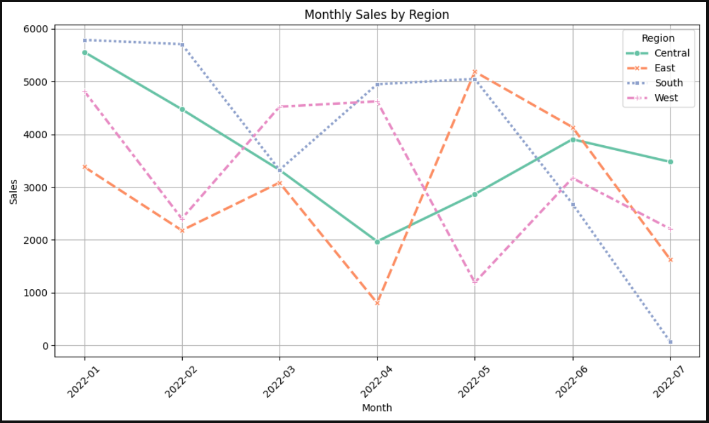

# 🛒 sales-eda-project

**Exploratory Data Analysis (EDA) of a Sales Dataset using Python, Pandas, Seaborn, and Matplotlib**

This project explores sales data to uncover key business insights through data visualization and trend analysis. The objective is to analyze sales, profit, and discount patterns across different product categories and customer segments to support decision-making.

---

## 📊 Key Objectives

- Perform data cleaning and transformation
- Analyze sales trends across months and sub-categories
- Visualize relationships between sales, profit, and discount
- Identify high-performing and underperforming sub-categories
- Understand regional or categorical distribution (based on available data)

---

## 🔧 Technologies Used

- Python 3.x
- Pandas
- Seaborn
- Matplotlib
- Jupyter Notebook

---

## 📁 Project Structure
sales-eda-project/
│
├── Sales_EDA_Project.ipynb # Jupyter notebook with full analysis
├── sales_data.csv # Dataset (if license permits)
├── README.md # Project overview (this file)
├── charts/ # Folder containing saved images (optional)
│ ├── monthly_trend.png
│ ├── profit_by_subcat.png
│ └── ...
├── Sales_EDA_Report.pdf # Optional final report (if created)


---

## ▶️ How to Run the Project

1. Clone the repository:
   ```bash
   git clone https://github.com/Rohitd1907/sales-eda-project.git
   cd sales-eda-project
2. Open the Jupyter Notebook
   ``` bash
   jupyter notebook Sales_EDA_Project.ipynb
3. Run the cells in sequence to explore the analysis.

## 📈 Key Insights

- **High Sales, Low Profit**: Sub-categories like "Chairs" and "Tables" have high sales but low profit margins.
- **Discount Impact**: Higher discounts correlate with reduced profits.
- **Monthly Trends**: Sales peak during specific months, indicating seasonal trends.


## 📊 Sample Visualizations


*Monthly Sales Trend*


*Profit by Sub-Category*

